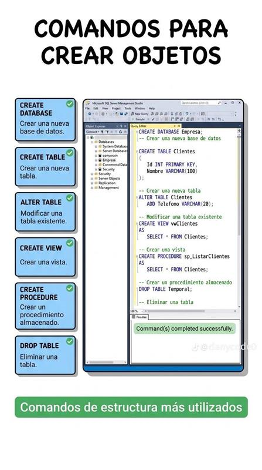
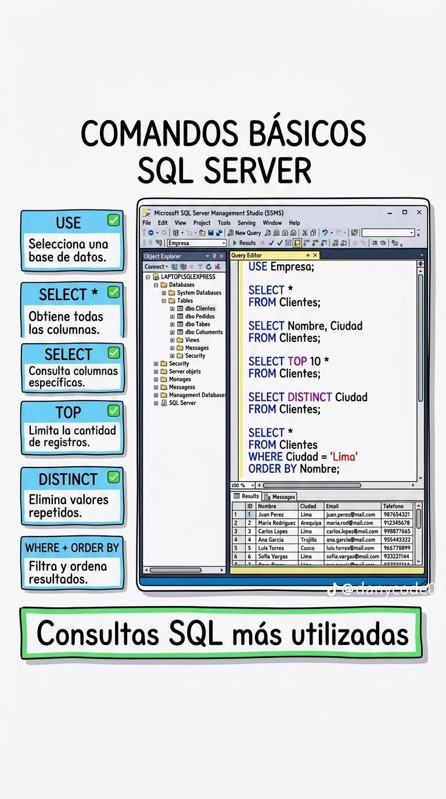
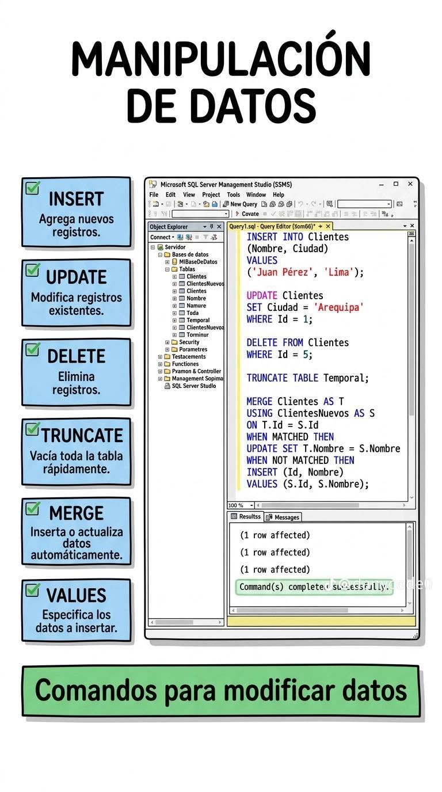
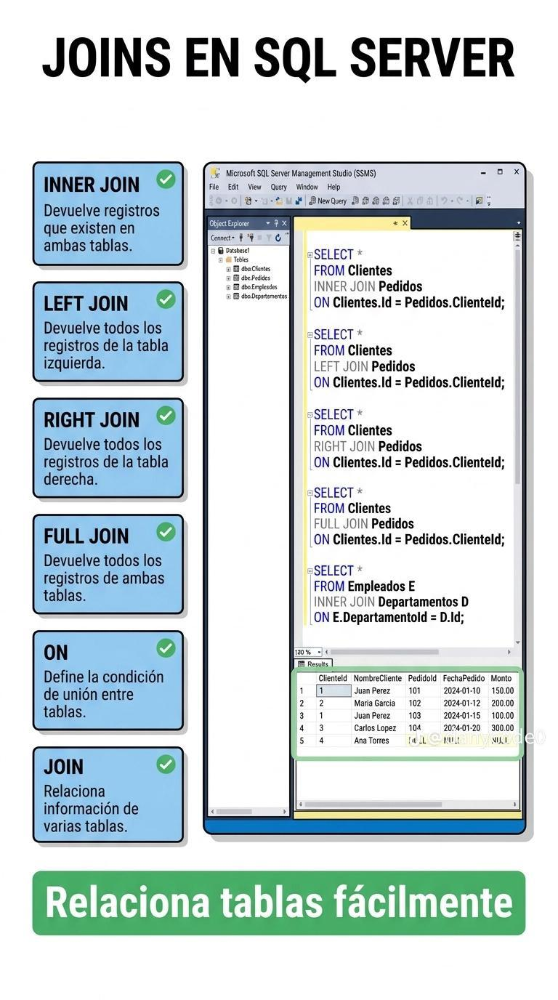
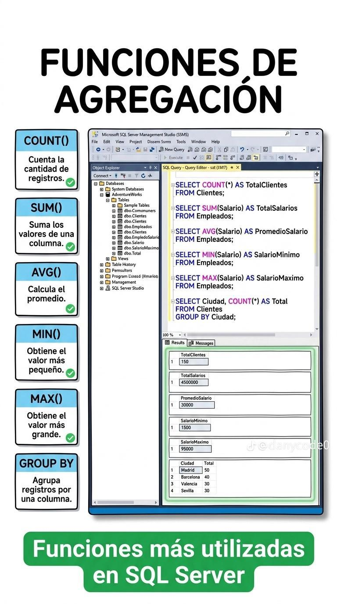
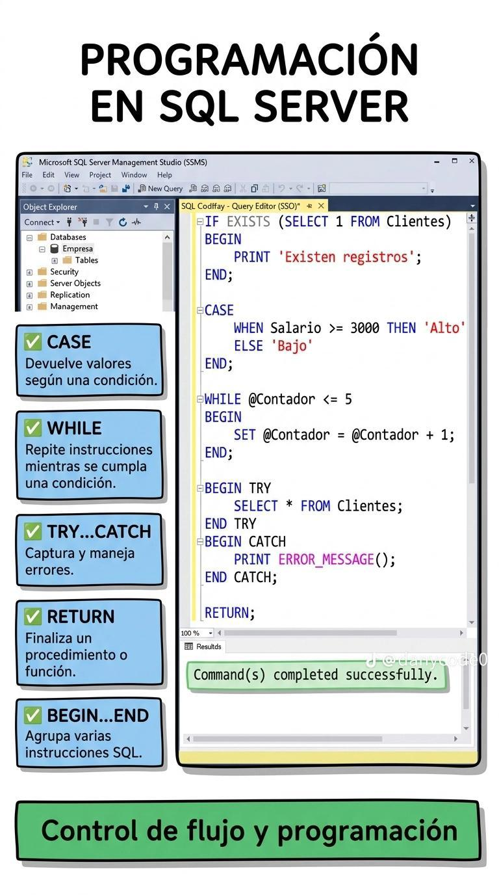
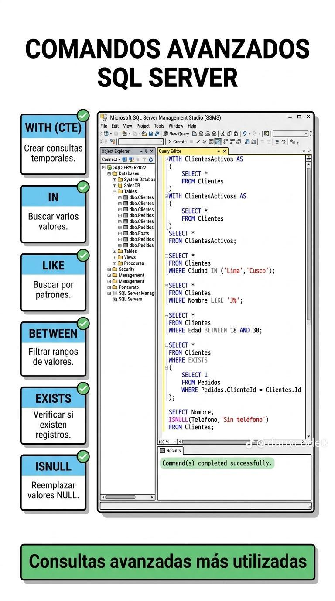

# SQLBasico: explicación y ejercicios prácticos

Material basado en las imágenes incluidas en `SQLBasico.docx`. Los ejemplos utilizan la sintaxis de Microsoft SQL Server.

## 1. Comandos para crear objetos



Los comandos de esta imagen pertenecen a la definición de datos (DDL). Se utilizan para crear, modificar o eliminar la estructura de una base de datos.

- `CREATE DATABASE` crea una base de datos nueva.
- `CREATE TABLE` crea una tabla y define sus columnas, tipos de datos y restricciones.
- `ALTER TABLE` modifica una tabla existente, por ejemplo, agregando una columna.
- `CREATE VIEW` crea una consulta guardada que puede consultarse como si fuera una tabla.
- `CREATE PROCEDURE` crea un procedimiento almacenado reutilizable.
- `DROP TABLE` elimina una tabla y todos sus datos. Debe utilizarse con cuidado.

### Ejercicio práctico
Crear una base de datos llamada `TiendaPractica`, una tabla de productos y una vista que muestre los productos disponibles.

```sql
CREATE DATABASE TiendaPractica;
GO

USE TiendaPractica;
GO

CREATE TABLE Productos
(
    IdProducto INT PRIMARY KEY,
    Nombre VARCHAR(80) NOT NULL,
    Precio DECIMAL(10, 2) NOT NULL,
    Existencia INT NOT NULL
);
GO

ALTER TABLE Productos ADD Categoria VARCHAR(50);
GO

CREATE VIEW ProductosDisponibles AS
SELECT IdProducto, Nombre, Precio, Existencia
FROM Productos
WHERE Existencia > 0;
GO
```

**Comprobación:** ejecutar `SELECT * FROM ProductosDisponibles;`.

## 2. Comandos básicos de consulta



Estos comandos sirven para consultar información almacenada.

- `USE` selecciona la base de datos que se utilizará.
- `SELECT *` devuelve todas las columnas de una tabla.
- `SELECT Nombre, Ciudad` devuelve únicamente las columnas indicadas.
- `TOP` limita la cantidad de filas mostradas.
- `DISTINCT` elimina valores repetidos.
- `WHERE` filtra las filas según una condición.
- `ORDER BY` ordena el resultado de forma ascendente (`ASC`) o descendente (`DESC`).

### Ejercicio práctico
Agregar productos y realizar consultas para buscar, ordenar y limitar resultados.

```sql
USE TiendaPractica;
GO

INSERT INTO Productos (IdProducto, Nombre, Precio, Existencia, Categoria)
VALUES
    (1, 'Teclado', 25.00, 10, 'Accesorios'),
    (2, 'Mouse', 15.50, 20, 'Accesorios'),
    (3, 'Monitor', 180.00, 0, 'Pantallas'),
    (4, 'Laptop', 650.00, 5, 'Computadoras');
GO

-- Todas las columnas
SELECT * FROM Productos;

-- Solo algunas columnas, ordenadas por precio
SELECT Nombre, Precio
FROM Productos
ORDER BY Precio DESC;

-- Los dos productos más caros
SELECT TOP 2 *
FROM Productos
ORDER BY Precio DESC;

-- Categorías sin repetir
SELECT DISTINCT Categoria
FROM Productos;

-- Productos disponibles y económicos
SELECT *
FROM Productos
WHERE Existencia > 0 AND Precio < 200;
```

## 3. Manipulación de datos



Estos comandos modifican los registros de una tabla.

- `INSERT` agrega registros nuevos.
- `VALUES` contiene los valores que serán insertados.
- `UPDATE` modifica registros existentes. Siempre se recomienda usar `WHERE`.
- `DELETE` elimina registros seleccionados. También debe llevar `WHERE` cuando no se desea borrar toda la tabla.
- `TRUNCATE TABLE` elimina rápidamente todos los registros y conserva la estructura de la tabla.
- `MERGE` compara una tabla de origen con una tabla destino para insertar o actualizar datos.

### Ejercicio práctico
Actualizar el precio de un producto, eliminar un producto agotado y cargar nuevos productos mediante `MERGE`.

```sql
USE TiendaPractica;
GO

-- Insertar un producto
INSERT INTO Productos (IdProducto, Nombre, Precio, Existencia, Categoria)
VALUES (5, 'Impresora', 120.00, 3, 'Oficina');

-- Actualizar un registro
UPDATE Productos
SET Precio = 22.00
WHERE IdProducto = 1;

-- Eliminar solo un registro
DELETE FROM Productos
WHERE IdProducto = 3;
GO

CREATE TABLE ProductosNuevos
(
    IdProducto INT PRIMARY KEY,
    Nombre VARCHAR(80) NOT NULL,
    Precio DECIMAL(10, 2) NOT NULL,
    Existencia INT NOT NULL,
    Categoria VARCHAR(50)
);
GO

INSERT INTO ProductosNuevos
VALUES
    (2, 'Mouse', 17.00, 25, 'Accesorios'),
    (6, 'Webcam', 45.00, 8, 'Accesorios');
GO

MERGE Productos AS destino
USING ProductosNuevos AS origen
ON destino.IdProducto = origen.IdProducto
WHEN MATCHED THEN
    UPDATE SET
        Nombre = origen.Nombre,
        Precio = origen.Precio,
        Existencia = origen.Existencia,
        Categoria = origen.Categoria
WHEN NOT MATCHED BY TARGET THEN
    INSERT (IdProducto, Nombre, Precio, Existencia, Categoria)
    VALUES (origen.IdProducto, origen.Nombre, origen.Precio,
            origen.Existencia, origen.Categoria);
GO
```

## 4. `JOIN` en SQL Server



Un `JOIN` relaciona filas de dos o más tablas mediante una columna común, normalmente una clave primaria y una clave foránea.

- `INNER JOIN` devuelve únicamente las filas que tienen coincidencia en ambas tablas.
- `LEFT JOIN` devuelve todas las filas de la tabla izquierda y las coincidencias de la tabla derecha.
- `RIGHT JOIN` devuelve todas las filas de la tabla derecha y las coincidencias de la tabla izquierda.
- `FULL JOIN` devuelve todas las filas de ambas tablas, coincidan o no.
- `ON` establece la condición que relaciona las tablas.

### Ejercicio práctico
Crear clientes y pedidos, y mostrar qué cliente realizó cada pedido.

```sql
USE TiendaPractica;
GO

CREATE TABLE Clientes
(
    IdCliente INT PRIMARY KEY,
    Nombre VARCHAR(80) NOT NULL,
    Ciudad VARCHAR(60) NOT NULL
);

CREATE TABLE Pedidos
(
    IdPedido INT PRIMARY KEY,
    IdCliente INT NOT NULL,
    Fecha DATE NOT NULL,
    Total DECIMAL(10, 2) NOT NULL,
    CONSTRAINT FK_Pedidos_Clientes
        FOREIGN KEY (IdCliente) REFERENCES Clientes(IdCliente)
);
GO

INSERT INTO Clientes VALUES
    (1, 'Ana Lopez', 'Managua'),
    (2, 'Carlos Perez', 'Leon'),
    (3, 'Maria Ruiz', 'Masaya');

INSERT INTO Pedidos VALUES
    (101, 1, '2026-09-01', 350.00),
    (102, 1, '2026-09-05', 125.00),
    (103, 2, '2026-09-07', 80.00);
GO

-- Solo clientes que tienen pedidos
SELECT c.Nombre, p.IdPedido, p.Fecha, p.Total
FROM Clientes AS c
INNER JOIN Pedidos AS p ON c.IdCliente = p.IdCliente;

-- Todos los clientes, incluso quienes no tienen pedidos
SELECT c.Nombre, p.IdPedido, p.Total
FROM Clientes AS c
LEFT JOIN Pedidos AS p ON c.IdCliente = p.IdCliente;

-- Total comprado por cada cliente
SELECT c.Nombre, COALESCE(SUM(p.Total), 0) AS TotalComprado
FROM Clientes AS c
LEFT JOIN Pedidos AS p ON c.IdCliente = p.IdCliente
GROUP BY c.Nombre;
```

## 5. Funciones de agregación



Las funciones de agregación calculan un resultado a partir de varias filas.

- `COUNT()` cuenta registros.
- `SUM()` suma los valores de una columna numérica.
- `AVG()` calcula el promedio.
- `MIN()` obtiene el valor mínimo.
- `MAX()` obtiene el valor máximo.
- `GROUP BY` agrupa filas para obtener resultados por categoría, ciudad u otra columna.

### Ejercicio práctico
Obtener la cantidad de productos, el precio total, el precio promedio, el precio menor y el mayor por categoría.

```sql
USE TiendaPractica;
GO

SELECT COUNT(*) AS CantidadProductos
FROM Productos;

SELECT SUM(Precio * Existencia) AS ValorInventario
FROM Productos;

SELECT AVG(Precio) AS PrecioPromedio,
       MIN(Precio) AS PrecioMinimo,
       MAX(Precio) AS PrecioMaximo
FROM Productos;

SELECT Categoria,
       COUNT(*) AS Cantidad,
       AVG(Precio) AS PrecioPromedio
FROM Productos
GROUP BY Categoria;
```

## 6. Programación y control de flujo



Estas instrucciones permiten tomar decisiones, repetir acciones y controlar errores dentro de bloques de código T-SQL.

- `IF...ELSE` ejecuta instrucciones según una condición.
- `CASE` devuelve un valor diferente según la condición evaluada.
- `WHILE` repite instrucciones mientras la condición sea verdadera.
- `TRY...CATCH` captura errores y permite mostrar un mensaje o ejecutar otra acción.
- `RETURN` finaliza un procedimiento o bloque de código y puede devolver un valor.
- `BEGIN...END` agrupa varias instrucciones como un solo bloque.

### Ejercicio práctico
Clasificar productos según su precio y controlar un error al intentar insertar un identificador repetido.

```sql
USE TiendaPractica;
GO

SELECT Nombre, Precio,
       CASE
           WHEN Precio >= 500 THEN 'Alto'
           WHEN Precio >= 100 THEN 'Medio'
           ELSE 'Bajo'
       END AS Clasificacion
FROM Productos;

DECLARE @Contador INT = 1;
WHILE @Contador <= 3
BEGIN
    PRINT 'Revisión número ' + CAST(@Contador AS VARCHAR(10));
    SET @Contador = @Contador + 1;
END;

BEGIN TRY
    INSERT INTO Productos (IdProducto, Nombre, Precio, Existencia, Categoria)
    VALUES (1, 'Producto repetido', 10.00, 1, 'Prueba');
END TRY
BEGIN CATCH
    PRINT 'Se produjo un error: ' + ERROR_MESSAGE();
END CATCH;
```

## 7. Comandos avanzados



Estos comandos permiten construir consultas más flexibles y reutilizables.

- `WITH` crea una expresión común de tabla (CTE), útil para organizar una consulta temporal.
- `IN` comprueba si un valor pertenece a una lista.
- `LIKE` busca coincidencias con patrones. `%` representa cualquier cantidad de caracteres.
- `BETWEEN` filtra valores dentro de un rango, incluyendo los extremos.
- `EXISTS` comprueba si una subconsulta devuelve al menos una fila.
- `ISNULL` reemplaza un valor `NULL` por otro valor indicado.

### Ejercicio práctico
Buscar clientes de determinadas ciudades, nombres que comiencen con una letra, pedidos dentro de un rango y clientes que tengan al menos un pedido.

```sql
USE TiendaPractica;
GO

-- Consulta temporal con CTE
WITH ClientesConPedidos AS
(
    SELECT c.IdCliente, c.Nombre, COUNT(p.IdPedido) AS CantidadPedidos
    FROM Clientes AS c
    INNER JOIN Pedidos AS p ON c.IdCliente = p.IdCliente
    GROUP BY c.IdCliente, c.Nombre
)
SELECT *
FROM ClientesConPedidos
WHERE CantidadPedidos > 0;

-- Buscar varias ciudades
SELECT *
FROM Clientes
WHERE Ciudad IN ('Managua', 'Masaya');

-- Buscar nombres que comiencen con "A"
SELECT *
FROM Clientes
WHERE Nombre LIKE 'A%';

-- Buscar pedidos entre dos totales
SELECT *
FROM Pedidos
WHERE Total BETWEEN 100 AND 400;

-- Clientes que tienen pedidos
SELECT c.Nombre
FROM Clientes AS c
WHERE EXISTS
(
    SELECT 1
    FROM Pedidos AS p
    WHERE p.IdCliente = c.IdCliente
);

-- Mostrar un texto cuando no exista ciudad
SELECT Nombre, ISNULL(Ciudad, 'Ciudad no registrada') AS Ciudad
FROM Clientes;
```

## Actividad integradora

Crear una base de datos llamada `BibliotecaPractica` con las tablas `Autores`, `Libros` y `Prestamos`. Luego:

1. Insertar al menos tres autores y cinco libros.
2. Consultar los libros publicados después del año 2020.
3. Mostrar cada libro junto con el nombre de su autor usando `INNER JOIN`.
4. Contar cuántos libros tiene cada autor usando `COUNT()` y `GROUP BY`.
5. Actualizar el estado de un préstamo con `UPDATE`.
6. Utilizar `CASE` para mostrar `Disponible` o `Prestado`.
7. Crear una CTE que muestre los autores que tienen más de un libro.

Esta actividad integra los comandos de las siete imágenes y permite comprobar que las instrucciones SQL funcionan juntas en un caso real.
